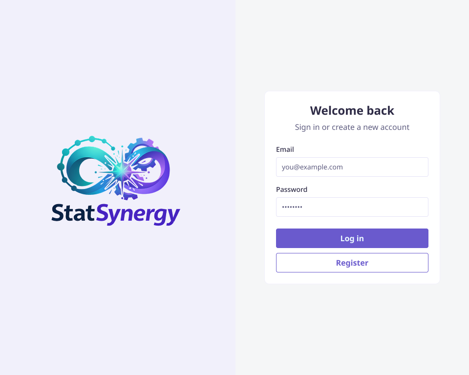
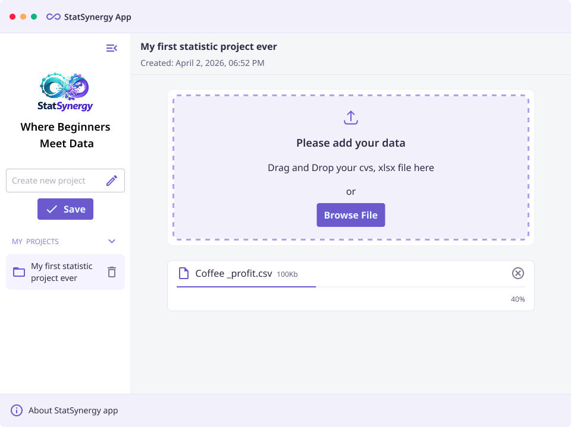
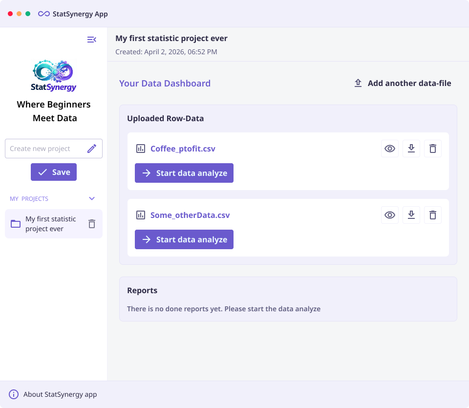
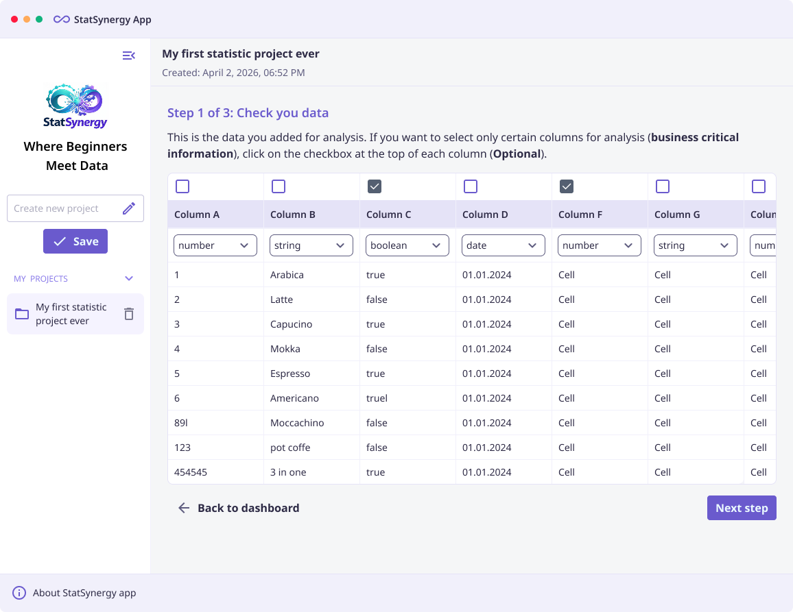
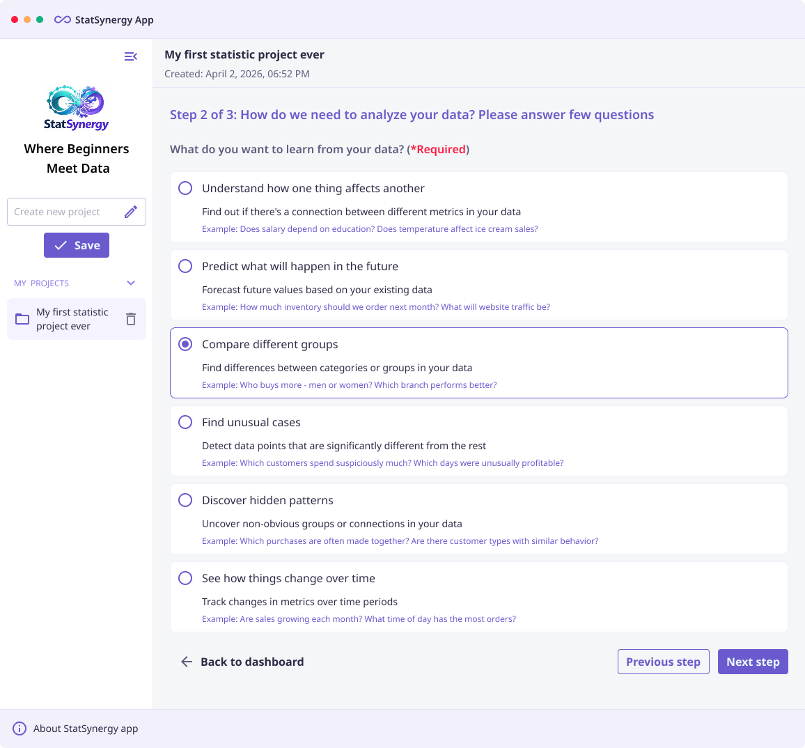

# StatSynergy — Frontend

> **Note:** This repository contains only a small public-facing portion of the StatSynergy application. The full project is significantly larger and more feature-rich than what is shown here.

StatSynergy is a statistical desktop web application built for analyzing and forecasting business growth and profitability. Designed with the philosophy _"Where Beginners Meet Data"_, it makes advanced statistical analysis accessible to business users without requiring a background in mathematics or data science.

---

## About the Project

StatSynergy is a start-up product that allows businesses to upload their raw data (CSV, XLSX), run statistical analysis through a guided step-by-step wizard, and receive actionable forecasting reports on growth and profitability.

The application is powered by a proprietary backend that implements unique mathematical algorithms developed and owned by a project colleague. These algorithms are the intellectual core of StatSynergy and are not publicly available.

---

## Tech Stack

| Layer                | Technology                                              |
| -------------------- | ------------------------------------------------------- |
| Desktop shell        | [Electron](https://www.electronjs.org/) v25             |
| UI framework         | [React](https://react.dev/) v18                         |
| Styling              | [Tailwind CSS](https://tailwindcss.com/) v3             |
| Bundler              | [Webpack](https://webpack.js.org/) v5 + Babel           |
| CSV parsing          | [PapaParse](https://www.papaparse.com/)                 |
| Virtualized lists    | [react-window](https://github.com/bvaughn/react-window) |
| Build & distribution | [electron-builder](https://www.electron.build/)         |

---

## Backend

This frontend **requires the StatSynergy backend** to function. The backend lives in a separate, private repository and is covered by a **Non-Disclosure Agreement (NDA)**.

The backend implements the proprietary mathematical and statistical algorithms that are the intellectual property of a project colleague. These algorithms are not open-source and are not included in this repository.

---

## Screenshots

> The screenshots below represent a small preview of the application. The full product includes additional screens, features, and analytical capabilities not shown here.

### Login



### Data Upload



### Data Dashboard



### Step 1 — Data Review & Column Selection



### Step 2 — Analysis Goal Selection



---

## Getting Started

### Prerequisites

- Node.js ≥ 18
- npm ≥ 9
- A running instance of the StatSynergy backend

### Install dependencies

```bash
npm install
```

### Run in development mode

```bash
npm run dev
```

This starts Electron with hot-reloading CSS via Tailwind watcher.

### Build for distribution

```bash
npm run build
```

The packaged application will be output to the `dist/` directory.

---

## License

The frontend code in this repository is provided for portfolio and demonstration purposes. The underlying statistical engine, mathematical models, and analytical algorithms are proprietary and protected under NDA. All intellectual property rights for the core algorithms belong to a project colleague.
